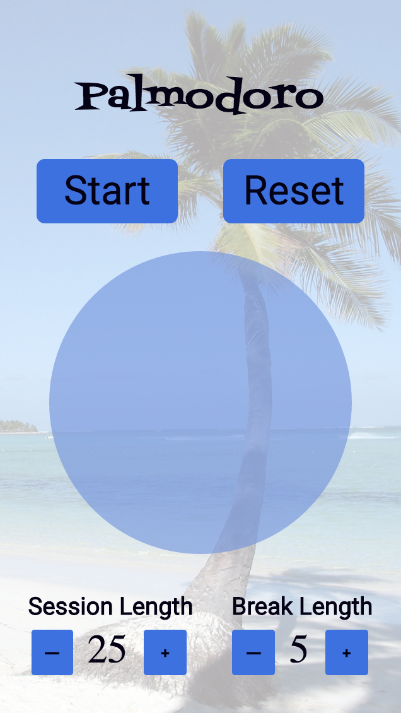

# Palmodoro

### Module 2, Project #2 - Created by Peter Springer & Kirsten Swanson

### Introduction
This is a pomodoro application that has a default start time of 25 minutes and a default break time of 5 minutes. The user can increase or decrease the duration of either the session length or break length. The pomodoro timer will indicate the final 20 seconds by flashing. At 20 seconds and every 5 second interval afterwards there will be a sound alert. The reset button will reset the session and break durations back to default settings.

### User Instructions
If you would like to use this application, you can clone this repository and then run npm install. 
